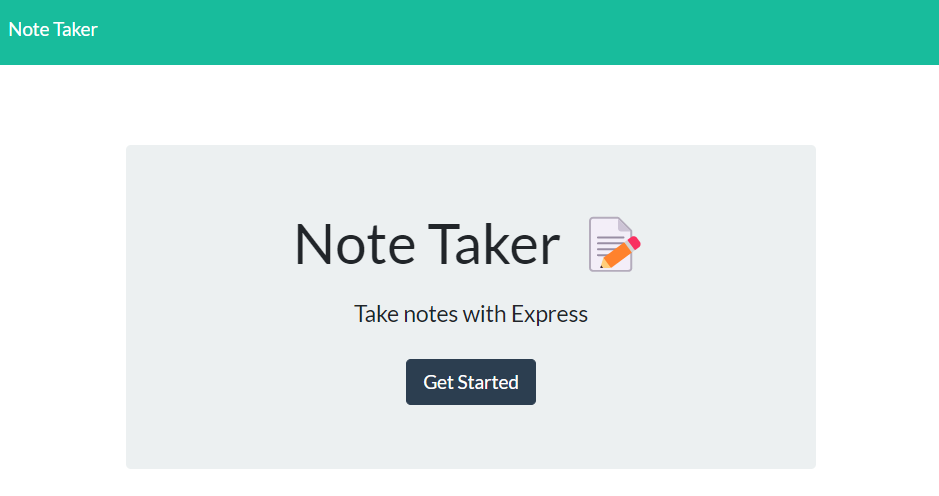
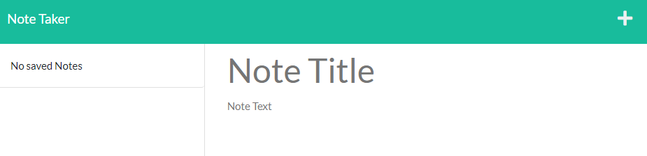
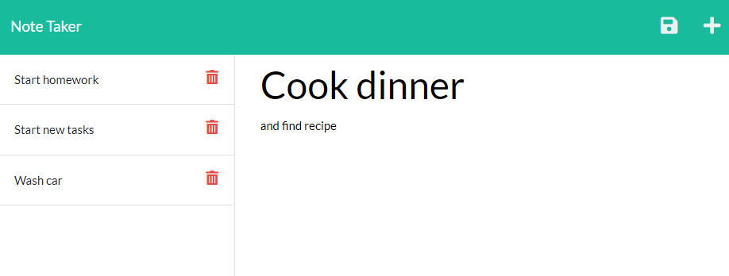

# Note Taker

## Description

Provided the front end of a note recording application, I used Express to create the back end and, subsequently, connect it to the front end to produce a fully functional application.

This was a challenge in understanding and creating Express routes, as well as understanding and leveraging existing front end code, written by another developer. 

## Usage

The deployed application can be found [here](https://note-taker-876.herokuapp.com).

THe below screenshot shows the home page. Click "Get Started" to navigate to the Notes page which allows you to begin creating and saving notes.

On the below page, there are currently no saved notes. Click into the "Note Title"  input area to begin creating a new note.

If you click on one of the existing notes from the saved notes section on the left, the content will appear in the main note creation section. Click on the plus sign in the top right hand corner to create a new note.

As shown, below, a new note is being created and the save icon appears on the top right hand side. Click the save button and the new note will appear at the bottom of the saved notes on the left.

To delete a note, click on the trash can icon next to the note's title, and it will be removed from the list.

## License

See repo for license information.